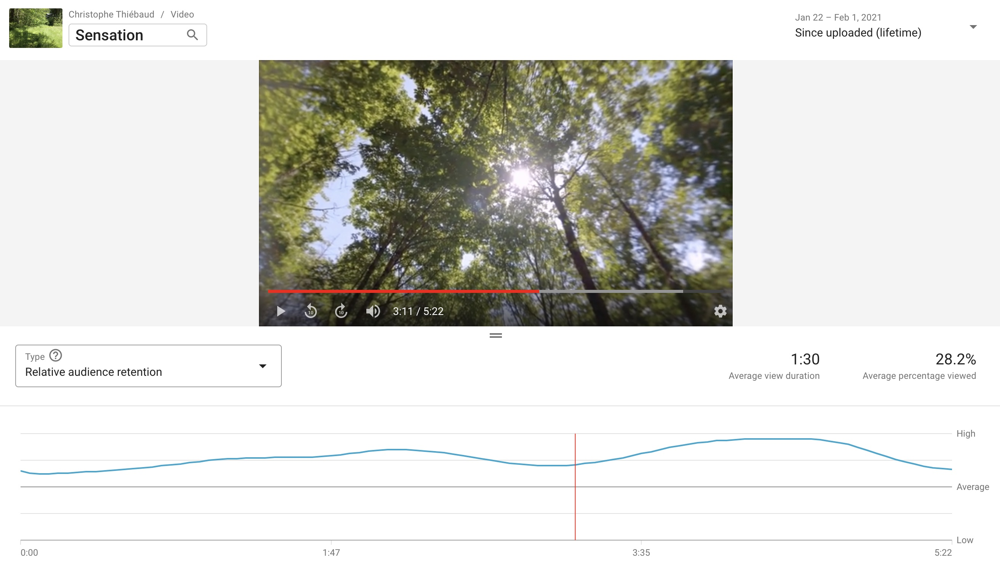

#  Mugnier & Thiebaud

1. Mugnier & Thiebaud is a French duo ; Mugnier writes texts, composes music, and paints pictures, Thiebaud composes music, writes arrangements, and develops software ; though Thiebaud is supposed to be a learned musician, songs by Mugnier are much better, hence Thiebaud's bitter jealousness.

2. Mugnier and Thiebaud met as teenagers ; Thiebaud enjoys now a well deserved pre-retirement ; Mugnier never ever went through paid work sufferings ; this conjunction of the stars leaves them some time for their endeavour.

3. Neither Mugnier nor Thiebaud are skilled or even interested in sound production ; both like songs with nice chords. Therefore the duo is looking for somebody to contribute to the production of their music, from story-telling to sound production to marketing to distribution.

4. A private soundcloud demo song is here:
[Sensation on soundclound](https://soundcloud.com/christophe-thiebaud/sensation-new-mix/s-oyXVmEq51cf)
; rather than listening to soundcloud (as said, production is not their strength), it is recommended to watch the small clip around it:
[Sensation on youtube](https://youtu.be/tkK7Bi7c7Wc), as it somehow distracts from the questionable sound quality ; one may also want to read what friends are [saying about the clip](https://www.facebook.com/christophe.thiebaud/posts/10158927764709593). It is worth to be noted that this hand-made video, with zero promotion effort, enjoys an integral above-average - when not close to high - relative audience retention.

If you are still with us, more here: [Songs for Vinyl Project](https://aequologica.net/vinyl/)

Thanks,

Mugnier & Thiebaud
